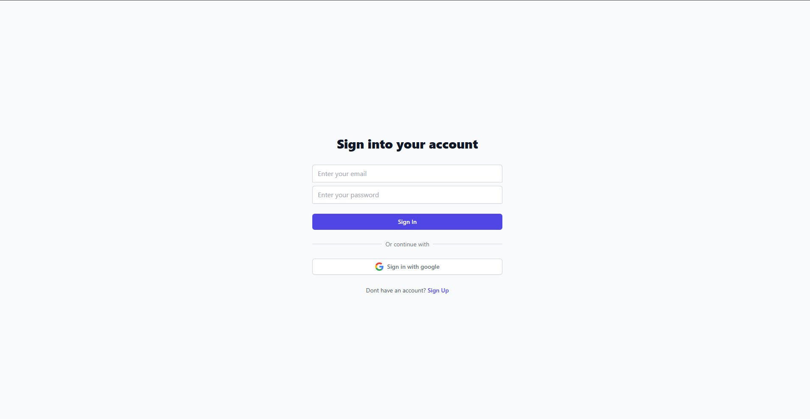
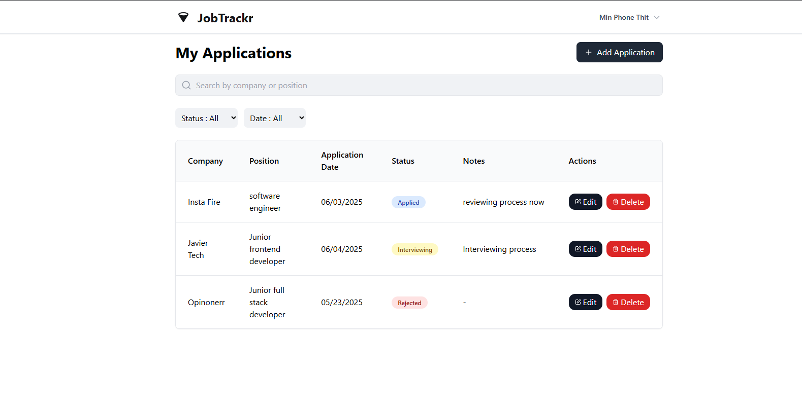
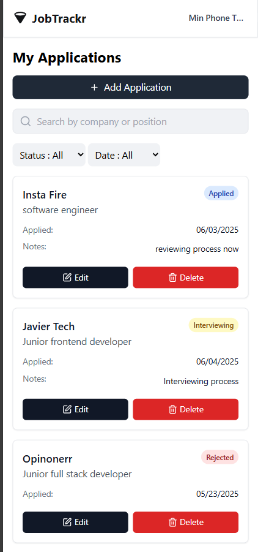
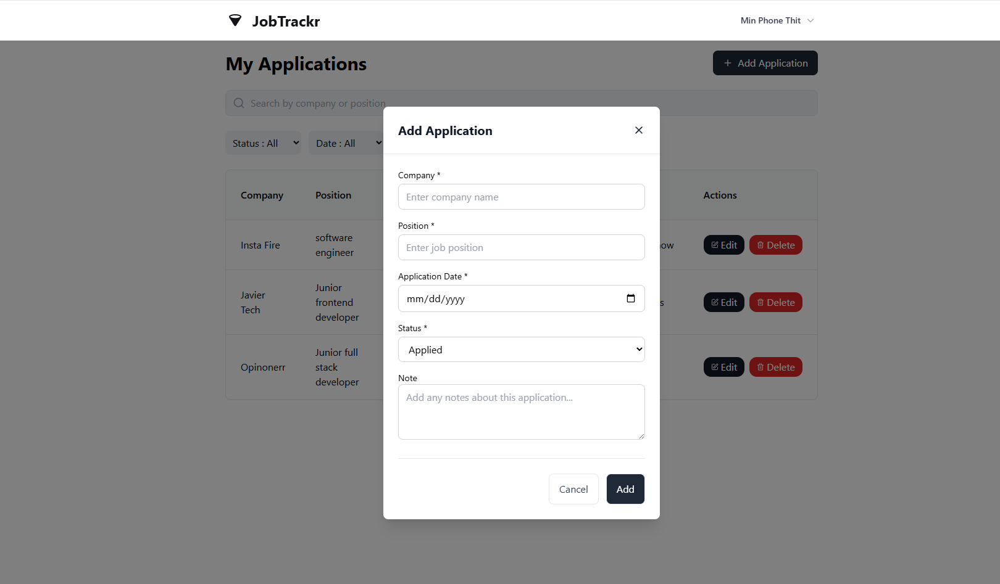
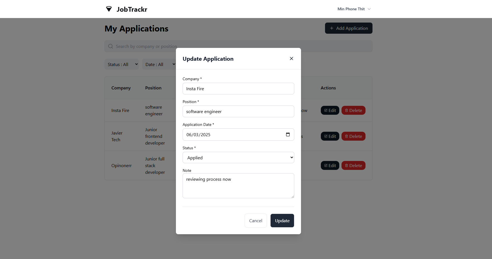

# Job Trackr


## Table of contents

- [Overview](#overview)
- [Features](#features)
- [Screenshots](#screenshots)
- [Tech Stack](#tech-stack)
- [Installation](#installation)

## Overview

Job Trackr is a modern web application designed to help job seekers organize and track their job applications efficiently. Keep track of companies you've applied to, interview stages, application dates, and personal notes all in one centralized dashboard.

**🌐 Try it live**: [jobtracker-frontend-iw4y.onrender.com](https://jobtracker-frontend-iw4y.onrender.com)

## Features

### Core Features
- 📝 **Application Management** - Add, edit, and delete job applications
- 🔍 **Search & Filter** - Search by company/position and filter by status or date
- 📱 **Responsive Design** - Works seamlessly on desktop, tablet, and mobile devices
- 🗓️ **Date Tracking** - Track application dates with intuitive date formatting
- 📊 **Status Management** - Organize applications by status (Applied, Interviewing, Rejected, Offered)
- 📔 **Notes System** - Add optional notes for each application

### User Experience
- 🚀 **Fast & Intuitive** - Clean, modern interface built with React
- 🔐 **Secure Authentication** - JWT-based user authentication
- 💾 **Data Persistence** - All data stored securely in MongoDB
- ⚡ **Real-time Updates** - Instant updates when managing applications

## Screenshots

### 🔐 Authentication


*Login and Register view along with google login*

### 🖥️ Desktop Dashboard


*Main dashboard showing applications table with search and filter functionality*

### 📱 Mobile Dashboard


*Mobile responsive dashboard with card-based layout for easy navigation*

### ➕ Add Application Modal


*Modal form for adding new job applications with all required fields*

### ✏️ Edit Application


*Edit existing applications with pre-filled data and status updates*

## Tech Stack

### Frontend
- **React 18** - Modern React with hooks
- **TypeScript** - Type-safe development
- **Tailwind CSS** - Utility-first CSS framework
- **Lucide React** - Beautiful icon library
- **Vite** - Fast build tool and dev server

### Backend
- **Node.js** - JavaScript runtime
- **Express.js** - Web framework
- **MongoDB** - NoSQL database
- **JWT** - JSON Web Tokens for authentication
- **bcrypt** - Password hashing

### Deployment
- **Frontend**: Deployed on Render
- **Backend**: RESTful API hosted separately
- **Database**: MongoDB Atlas (Cloud)

## Installation

### Prerequisites
- Node.js (v16 or higher)
- npm or yarn
- MongoDB (local or cloud instance)

### Clone the Repository
```bash
git clone https://github.com/Billy1437/jobtracker.git
cd jobtracker
